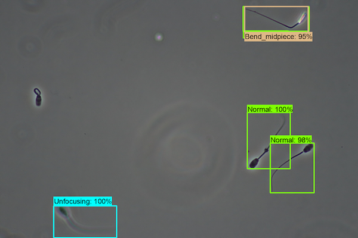
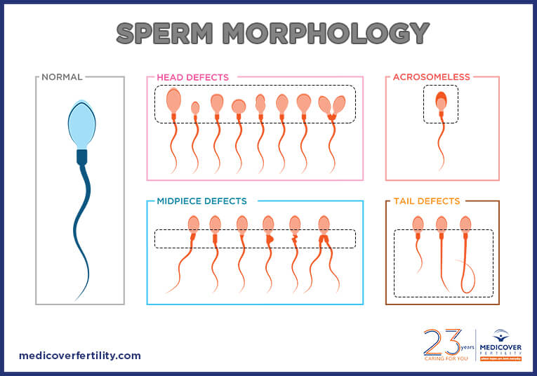
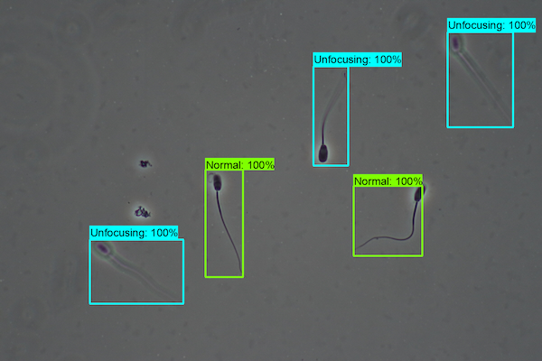

# object_detection_morphology
Object detection of sperm entities according to morphological classification in microscopic images with diverse magnification using TensorFlow2.

  

## INTRODUCTION

 Sperm morphological analysis is widely used for therapy of infertility which are applied to select superior breeding in reproductive biomedical field. Understanding morphological features and quantitating the distribution improve the sperm analysis process to maximise reproductive fertility. This study is expected to contribute not only to the meat production industry, but also to the medical field such as cure of sterility nad infertility. 

## DATA
  

* Images : 653
* Image size : 1200x800 px
* Entity : 10 pigs
* Magnificiant mode : 400x-215 images and 1000x-438 images
* Class : 20 (Normal, Flipped, unfocused, double head ... etc)
<!-- * Annotation : 400x; 2,732 AR + 1,741 Non-AR
               1000x; 2,385 AR + 996 Non-AR -->
* Data Split : train (80%) and test (20%)
               (mode = random)

## DEPENDENCY SPECIFICATION
* TensorFlow 2.11.0
* Python 3.8.0
* pandas 1.14
* numpy 1.22.4
* Pillow 9.3.0

## RESULT
|  |400x           |
|--|---------------|
|1 ||
|2 ||

↑ Visible results of trained model on test dataset  
 

(!) Detail of result will be uploaded after publication...

## FUTURE WORK
* Change annotation methodology (edge)
* [Analyze sperm motility](https://github.com/boguss1225/sperm_motility_analyzer)

## PAPER
[Deep learning based automatic acrosome reaction
classification system in sperm](https://manuscriptlink-society-file.s3-ap-northeast-1.amazonaws.com/sma/conference/sma2020fall/presentation/12.pdf)

## ACKNOWLEDGEMENTS
This study was supported by National Research Foundation of Korea (NRF 2019R1I1A1A01060932), Republic of Korea

## RELATED WORK
* https://github.com/boguss1225/object_detection_acrosome
* https://github.com/boguss1225/tensorflow-summary-box-addon
* https://github.com/tensorflow/models/tree/master/research/object_detection
* https://github.com/boguss1225/Iris-Segmentation-Keras
